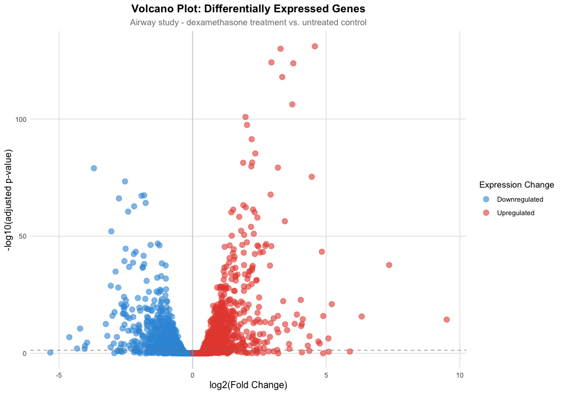
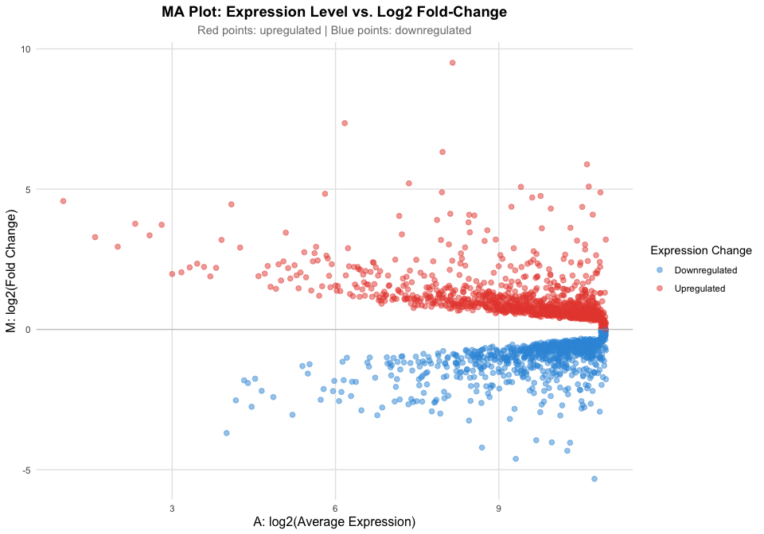

# Airway Study: RNA-seq Analysis Report

2026-03-27

# Airway Study: RNA-seq Transcriptome Analysis

This report presents a differential gene expression analysis of the
airway dataset from Himes et al. (2014). The study examines
transcriptomic changes in airway smooth muscle cells in response to
dexamethasone treatment using RNA-seq technology.

## Interactive Version

Want to explore the data interactively? Check out the **[Interactive
Shiny Report](Airway_shiny.html)** where you can adjust significance
thresholds and dynamically filter the genes in real-time!

## Volcano Plot of Differentially Expressed Genes

The volcano plot below displays the log2 fold-change versus the adjusted
p-value for the top 2,000 most significant genes. Points are colored by
direction of expression change: upregulated genes (positive log2FC) are
shown in red, while downregulated genes (negative log2FC) are shown in
blue.

## MA Plot: Expression vs. Fold Change

The MA plot presents the average log2 expression level (x-axis) versus
the log2 fold-change (y-axis) for all 2,000 genes. This visualization
helps identify expression patterns across different abundance levels.

## Summary Statistics

    **Total genes analyzed:** 2000

    **Significantly regulated genes (padj < 0.05):** 1413

      - Upregulated: 817

      - Downregulated: 596

    **Top 10 Most Significant Genes:**

                     symbol log2FoldChange        pvalue          padj
    ENSG00000152583 SPARCL1       4.574967 4.110667e-136 9.195151e-132
    ENSG00000165995  CACNB2       3.291099 4.463384e-135 9.984145e-131
    ENSG00000120129   DUSP1       2.947850 3.033840e-129 6.786396e-125
    ENSG00000101347  SAMHD1       3.767022 7.682657e-129 1.718534e-124
    ENSG00000189221    MAOA       3.353655 5.212706e-123 1.166030e-118
    ENSG00000211445    GPX3       3.730439 2.585059e-111 5.782519e-107
    ENSG00000157214  STEAP2       1.976796 6.091349e-106 1.362574e-101
    ENSG00000162614    NEXN       2.035697 1.565462e-102  3.501783e-98
    ENSG00000125148    MT2A       2.211006  1.849644e-96  4.137469e-92
    ENSG00000154734 ADAMTS1       2.345635  2.266757e-90  5.070508e-86

## References

This analysis is based on the RNA-seq dataset and methods described in
Himes et al. (2014).

Himes, Blanca E., Xiaofeng Jiang, Peter Wagner, Ruoxi Hu, Qiyu Wang,
Barbara Klanderman, Reid M. Whitaker, et al. 2014. “RNA-Seq
Transcriptome Profiling Identifies CRISPLD2 as a Glucocorticoid
Responsive Gene That Modulates Cytokine Function in Airway Smooth Muscle
Cells.” Edited by Jan Peter Tuckermann. *PLoS ONE* 9 (6): e99625.
<https://doi.org/10.1371/journal.pone.0099625>.

